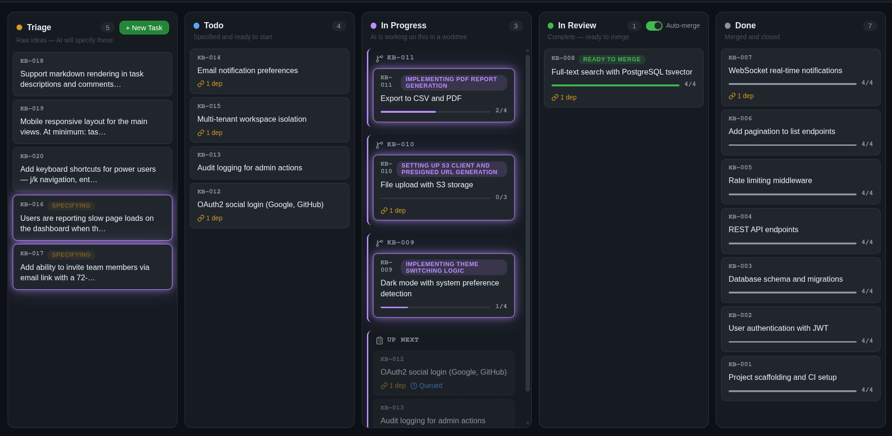
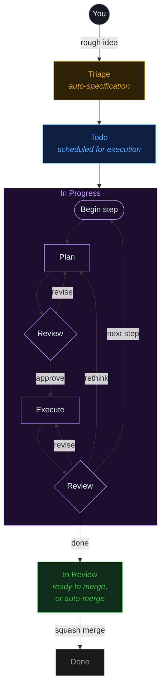

# kb

AI-orchestrated task board. Like Trello, but your tasks get specified, executed, and delivered by AI — powered by [pi](https://github.com/badlogic/pi-mono).



## Workflow



Tasks with dependencies are processed sequentially. Independent tasks run in parallel.

## Quick Start

```bash
npm i -g @dustinbyrne/kb
```

Then from the root of your repository:

```bash
kb dashboard
```

Open [http://localhost:4040](http://localhost:4040) — create tasks from the board or the CLI.

### CLI commands

```bash
kb task create "Fix the login redirect bug"
kb task create "Button misaligned" --attach screenshot.png
kb task list
kb task show KB-001
kb task move KB-001 todo
kb task merge KB-001
```

Agents can use these same commands, or see [`.agents/skills/`](.agents/skills/) for structured skill docs.

### Prerequisites

The AI engine uses [pi](https://github.com/badlogic/pi-mono) under the hood:

1. `npm i -g @mariozechner/pi-coding-agent`
2. Run `pi` and use `/login`, or set `ANTHROPIC_API_KEY`

kb reuses your existing pi authentication.

## Packages

| Package         | Description                                                     |
| --------------- | --------------------------------------------------------------- |
| `@kb/core`      | Domain model — tasks, board columns, file-based store           |
| `@kb/dashboard` | Web UI — Express server + kanban board with SSE                 |
| `@kb/engine`    | AI engine — triage (pi), execution (pi + worktrees), scheduling |
| `kb` (cli)      | CLI — `kb dashboard`, `kb task create/list/move/attach`         |

## Architecture

### Task Storage

Tasks live on disk in `.kb/tasks/` in the project root:

```
.kb/
├── config.json              # Board config + ID counter
└── tasks/
    └── KB-001/
        ├── task.json        # Metadata (column, deps, timestamps)
        ├── PROMPT.md        # Task specification
        └── attachments/     # File attachments — images & text files (optional)
```

### Board UI

Real-time kanban board at `localhost:4040`:

- Drag-and-drop cards between columns
- Create tasks from the web UI
- Click cards for detail view with move/delete actions
- Server-Sent Events for live updates across tabs

### AI Engine

The AI engine starts automatically with the dashboard. Three components run:

- **TriageProcessor** — Watches triage column. Spawns a pi agent session that reads the project, understands context, and writes a full PROMPT.md specification. Moves task to todo.

- **Scheduler** — Watches todo column. Resolves dependency graphs. Moves tasks to in-progress when deps are satisfied and concurrency allows (default: 2 concurrent). When `groupOverlappingFiles` is enabled in settings, tasks whose `## File Scope` sections share files are serialized to prevent merge conflicts.

- **TaskExecutor** — Listens for tasks entering in-progress. Creates a git worktree, spawns a pi agent session with full coding tools scoped to the worktree, and executes the specification. Moves to in-review on completion.

Each pi agent session gets:

- Custom system prompt for its role (triage specifier vs task executor)
- Tools scoped to the correct directory (`createCodingTools(cwd)`)
- In-memory sessions (no persistence needed)
- The user's existing pi auth (API keys from `~/.pi/agent/auth.json`)

## Development

```bash
pnpm install
pnpm dev dashboard              # Board + AI engine
pnpm dev task list              # CLI commands
```

## Building a standalone executable

You can build a single self-contained `kb` binary using [Bun](https://bun.sh/):

```bash
pnpm build:exe
```

This compiles all TypeScript, builds the dashboard client, and produces:

- `packages/cli/dist/kb` — the standalone binary
- `packages/cli/dist/client/` — co-located dashboard assets

Run the binary directly — no Node.js, pnpm, or workspace setup needed:

```bash
./packages/cli/dist/kb --help
./packages/cli/dist/kb task list
./packages/cli/dist/kb dashboard
```

To distribute, copy both the `kb` binary and the `client/` directory together.

### Cross-compilation

Build binaries for all supported platforms from a single machine:

```bash
pnpm build:exe:all
```

This produces binaries for all supported targets in `packages/cli/dist/`:

| Target             | Output               |
| ------------------ | -------------------- |
| `bun-linux-x64`    | `kb-linux-x64`       |
| `bun-linux-arm64`  | `kb-linux-arm64`     |
| `bun-darwin-x64`   | `kb-darwin-x64`      |
| `bun-darwin-arm64` | `kb-darwin-arm64`    |
| `bun-windows-x64`  | `kb-windows-x64.exe` |

To build for a specific platform:

```bash
pnpm --filter kb build:exe -- --target bun-linux-x64
```

The `client/` directory is shared across all binaries (platform-independent assets).

You can override the dashboard asset path via the `KB_CLIENT_DIR` environment variable:

```bash
KB_CLIENT_DIR=/path/to/client ./kb dashboard
```

**Prerequisites:** Bun ≥ 1.0 (`bun --version`)

## Releases

Packages are published to npm automatically via GitHub Actions and [changesets](https://github.com/changesets/changesets).

### Installing from npm

```bash
npm install -g kb
```

### Triggering a release

Releases are automated via [changesets](https://github.com/changesets/changesets). See [RELEASING.md](./RELEASING.md) for the full workflow.

In short: add a changeset with `pnpm changeset`, merge to main, then merge the auto-generated "Version Packages" PR. Once merged, the workflow automatically publishes all updated packages to npm.

### CI pipeline

- **Pull requests & pushes to main** — runs tests and build (`.github/workflows/ci.yml`)
- **Push to main** — creates a version PR (if changesets exist) or publishes to npm (`.github/workflows/version.yml`)

## License

ISC
